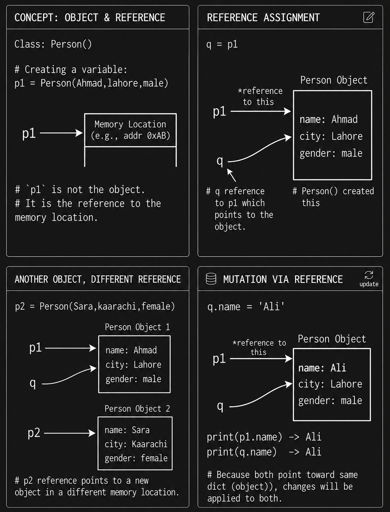

# This is the summary of day 2 and 3 combined of this week:

## Day 2:

I solved some problems from my first lecture on OOP to practice all concepts by hand I learned and then i started my lecture 2 on OOP in which i covered about one main thing in depth which is everything in python is an object and how the object we create like c1 = Class() here actually c1 is not the object its just the reference to the memory location where an object is being created if i only write Class() object will be created but then i can't do anything bcz i didn't store it anywhere. Here are my notes on this small but imp detail:

**Reference Variables**

If we have a class (`Person`) and I create an object `p1`, now this `p1` is actually not the object, its just the reference of the memory location where an object is created.

```python
# This syntax will create an object of the class Person so when we do :-

p1 = Person()

# Here the object is not p1, the p1 is just the reference to the object created using the syntax Person()
```

We can also make more references like:-

```python
q = p1
```

Now `q` and `p1` both point to the same obj. One can change or add a thing, effect will be on both.

```python
q.name = "Ali"

print(p1.name) -> Ali
print(q.name)  -> Ali
```

Bcz both point toward same dict (object) changes will be applied to both. This image explains all this beautifully:



## Day 3:

On day 3 i covered the remaining lecture on oop part 2 in which i covered mostly about the concept of Encapsulation in python and understood why python doesn't really hide the private var and methods here is my notes and analogy on this:

The question is if we can access and modify the private variables and methods then what's the point of creating them, the answer is private vars and methods are hidden a bit by python like you cannot see their names when you import a class and doing this tells any other person using your class that this is a private variable please don't modify or access it.

Its just like how constants work in Python we use uppercase vars for constants and other programmers and we don't change them because everyone knows they must not be changed there must be a reason a constant is created while Python allows us to change no one changes it its understanding between all developers same concept applies to private vars and methods you can access them and modify them out of class but no one will.

After Encapsulation i covered about static variables and method and found them very helpful especially one usecase is static variables can help us in increment logic. for eg if we have object as student and we want to assign each one a unique roll number then we will use static keyword

```python
class Student:
  school = 'XYZ'
  rno = 1
  def __init__(self,name,grade):
    self.name = name
    self.grade = grade
    self.rno = Student.rno
    Student.rno+=1
    print(f"{self.name} is in {self.grade} grade and reads in {Student.school} School and has a roll number: {self.rno}")

s1 = Student('Ahmad',11)
s2 = Student('ali',10)
```

Also covered static method but a bit unsure about their use will try some problems on it on day 4 to understand where can they be helpful

My detailed notes are on notion check this one out for day 2 and 3 notes:
https://app.notion.com/p/OOP-Lecture-2-39d75544465580138e29d2a726d2128c?source=copy_link
